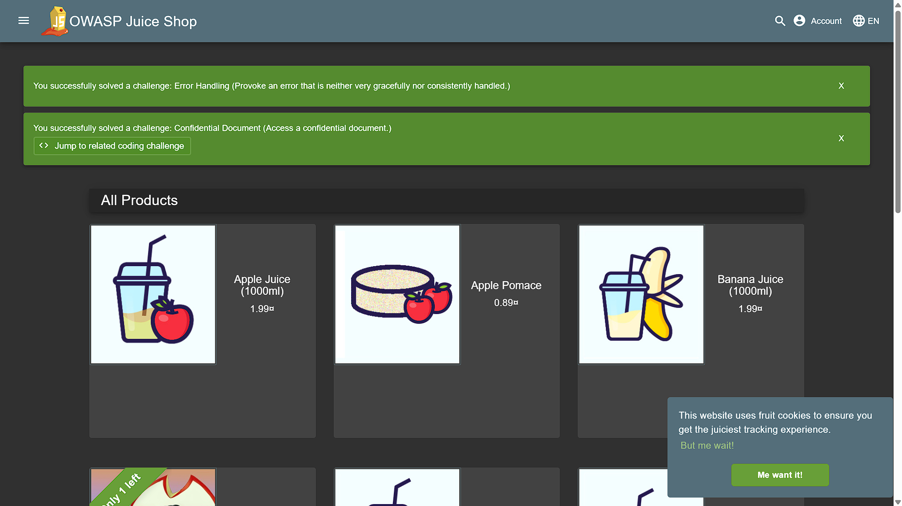

## VM should be connected
```bash
sudo apt update
sudo apt upgrade -y
```

## Install Docker
```bash
sudo apt install docker.io -y
```

## Enable and start Docker
```bash
sudo systemctl enable docker
```
```bash
sudo systemctl start docker
```
## Allow current user
```bash
sudo usermod -aG docker $USER
```
Now exit the VM and reconnect after that, check your Docker status
```bash
exit
docker --version
```
## To check whether Docker is connected, run:
```bash
docker run hello-world
```
The above command will display Hello from Docker.

## Run OWASP Juice Shop using Docker (Vulnerable App)
```bash
docker run -d -p 3000:3000 bkimminich/juice-shop

```
### Check container
```bash
docker ps
```
## Open the Vulnerable Website at http://20.xx.xx.xx:3000

## Install OWASP ZAP
### Pull ZAP Docker image and check
```bash
docker pull ghcr.io/zaproxy/zaproxy
docker images
```
## Create a directory
```bash
mkdir zap-results
```
## Run Automated Baseline Scan
Run ZAP scan on Juice Shop
```bash
docker run --rm ghcr.io/zaproxy/zaproxy zap-baseline.py -t http://20.xx.xx.xx:3000
```
## Generate Scan Report
```bash
docker run --rm -v $(pwd):/zap/wrk ghcr.io/zaproxy/zaproxy zap-baseline.py -t http://20.xx.xx.xx:3000 -r zap-report.html
```
## open zap-report.html in your browser
```bash
cd ~/zap-results
python3 -m http.server 8000
```
## Browse - http://20.xx.xx.xx:8000/zap-report.html

## Output 
<p align="center">
  
</p>
<p align="center">
  
</p>
